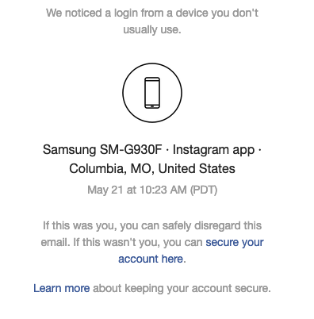

# How to upload to Instagram from non-mobile devices

Uploading photos and videos to Instagram from your laptop or desktop isn't easy. It seems as though Instagram would prefer that their users upload media *only* from their phones and tablets.

But there are work-arounds.

In this article, we'll show you how to set up and use a simple, free tool for uploading to the 'gram from your computer's command-line interface (CLI).

These instructions were written assuming you're using a Mac.

## Set up

The tool we'll be using is [`instapy-cli`](https://github.com/instagrambot/instapy-cli). Since it was written in Python, you need to configure your computer's Python environment before installing and using this tool.

**Note:** You'll only have to go through this set up process once on a given computer.

These set up instructions were borrowed from the [Hitchhiker's Guide to Python](https://docs.python-guide.org/starting/install3/osx/), an excellent resource for all things related to Python.

### 1. Open a terminal window

Your Mac's default terminal emulator is [Terminal](https://support.apple.com/guide/terminal/welcome/mac). You can find it in your Applications folder or by using [Spotlight](https://support.apple.com/guide/mac-help/spotlight-mchlp1008/mac).

### 2. Check your Python version

Type:

```
python --version
```

And you will probably see:

```
Python 2.7.15 
```

This is the version of Python that Apple pre-installed on your system. We *do not* want to mess with this installation of Python or any of its dependencies. That's why in the following steps we'll be installing a newer version of Python separate from this pre-installed version.

If your terminal printed `Python 3.` instead of `Python 2.`, then skip steps 3 through 5 in this section.

### 3. Install Install Xcode Command Line Tools

Xcode is a large suite of software development tools provided by Apple. We only need some of these tools (e.g., the GCC compiler), which is included in the subset Xcode called the Command Line Tools.

In your terminal, type:

```
xcode-select --install
```

You'll then see a prompt that looks like this:


Select "Install", then chill for a few minutes.

### 3. Install homebrew

[Homebrew](https://brew.sh/) is the de-facto (yet un-official) package manager for macOS. It helps us install and configure a lot of useful software you won't find on the App Store.

You already may have installed Homebrew. Let's check by updating to the latest version:

```
brew update
```

If you get get something like this:

```
Updated Homebrew from bb038c7048 to ff3cede96f.
Updated 2 taps (homebrew/core, homebrew/cask).
==> New Formulae
i2pd                                      opensubdiv                                tdlib
==> Updated Formulae
cgal ✔                                    go                                        logstash
cmake ✔                                   godep                                     mariadb
```

Then you can skip the rest of this step. But if you get this:

```
brew: command not found
```

Then you need to install Homebrew like this:

```
/usr/bin/ruby -e "$(curl -fsSL https://raw.githubusercontent.com/Homebrew/install/master/install)"
```

You will see a prompt that looks like this:

```
==> This script will install:
/usr/local/bin/brew
/usr/local/share/doc/homebrew
/usr/local/share/man/man1/brew.1
/usr/local/share/zsh/site-functions/_brew
/usr/local/etc/bash_completion.d/brew
/usr/local/Homebrew
==> The following new directories will be created:
/usr/local/bin
/usr/local/etc
/usr/local/include
/usr/local/lib
/usr/local/sbin
/usr/local/share
/usr/local/var
/usr/local/opt
/usr/local/share/zsh
/usr/local/share/zsh/site-functions
/usr/local/var/homebrew
/usr/local/var/homebrew/linked
/usr/local/Cellar
/usr/local/Caskroom
/usr/local/Homebrew
/usr/local/Frameworks

Press RETURN to continue or any other key to abort
```

So then press RETURN, and enter the password you use to login to your Mac.

### 4. Add Homebrew's directory to your `PATH`

Your shell environment can't find Homebrew's directory (i.e., the folder on your computer that stores Homebrew's data) unless we add it to an environment variable named `PATH`.

Instead of configuring this setting every time you open a terminal window, you can add it to a system file named `.profile`. Here's how:

```
echo -e 'export PATH="/usr/local/opt/python/libexec/bin:$PATH"' >> ~/.profile
```

Since `.profile` executes every time you open a terminal window, now your shell environment can always find Homebrew's directory when it needs it.

**Before your proceed**: Close your current terminal window and open a new one.

### 5. Install Python 3

Now we can use Homebrew to install the latest version of Python.

After you've opened a new terminal window, type:

```
brew install python
```

Wait a few minutes until the installation process completes. Then once again check which version of Python your shell recognizes. Type:

```
python --version
```

And you should see:

```
Python 3.7.3 
```

### 6. Install FFmpeg

One of the dependencies for `instapy-cli` is [FFmpeg](https://ffmpeg.org/), which is necessary for pre-processing photos and videos before uploading them.

We can install this utility using Homebrew:

```
brew install ffmpeg
```


### 7. Install instapy-cli

Finally, we can install the tool we actually want to use!

As with any Python packages, `instapy-cli` can be installed via the Python's package manager, named `pip`. Type:

```
pip install instapy-cli
```

When that installation process completes, we can confirm our success by typing:

```
instapy
```

And we should see:

```
instapy-cli 0.0.12  |  python 3.7.3
[USE] instapy -u USR -p PSW -f FILE/LINK -t 'TEXT CAPTION'

For other reference go to >> https://github.com/b3nab/instapy-cli
```

## Demo

Once you've set everything up, here's how you can use the tool.

1. Open a terminal window.
2. Invoke the `instapy`  command along with your upload options.\
	\
	For instance, if your Instagram user name were `paulpepperradiofriends`, and you wanted to upload a file called `my-movie.mp4` on your desktop, you would type:

	```sh
	instapy -u paulpepperradiofriends -f ~/Desktop/my-movie.mp4
	```

3. Press RETURN.
4. When prompted, type your Instagram password (the password will stay hidden while you type it).
5. Wait a bit until the command prints `Done`.

Below are all the options instapy-cli will accept:

```sh
instapy-cli 0.0.12  |  python 3.7.3
Usage: instapy [options]

Options:
  -h, --help   show this help message and exit
  -u USERNAME  username
  -p PASSWORD  password
  -f FILE      file path or url
  -t CAPTION   caption text
  -s           publish to story
```

## Epilogue

After you using `instapy-cli`, you might receive an automatic email from Instagram notifying you about a login from an unfamiliar device, specifically a Samsung SM-G930F.



You can safely disregard this email. Your account has not been hacked. Rather, this is the device data provided by `instapy-cli` in order to trick Instagram into believing that you are uploading media from a mobile device.
